# YouSchool – CAP Céramiste : Documentation de l'interface

> **Plateforme d'e-learning** pour la formation CAP Céramiste.  
> URL : https://youschool.io/cap_ceramiste  
> Date de capture : 22 juin 2026

---

## Table des matières

1. [Structure générale](#1-structure-générale)
2. [Accueil – Fil d'actualité](#2-accueil--fil-dactualité)
3. [Tableau de bord](#3-tableau-de-bord)
4. [Ma formation](#4-ma-formation)
5. [Informations officielles](#5-informations-officielles)
6. [Agenda](#6-agenda)
7. [Défis](#7-défis)
8. [Groupes](#8-groupes)
9. [Profil utilisateur](#9-profil-utilisateur)
10. [Éléments transversaux](#10-éléments-transversaux)

---

## 1. Structure générale

L'interface se compose de trois zones principales :

- **Sidebar gauche (fixe)** : navigation principale entre les grandes sections. Contient aussi les liens "Assistance & contact", "Questions fréquentes", et "Conditions générales".
- **Barre supérieure** : logo, barre de recherche, bouton "Reprendre mon cours", notifications d'école (🔔), notifications communauté (🌐), et menu utilisateur.
- **Zone de contenu centrale** : affichage de la section sélectionnée.

**Sections de navigation :**
| Icône | Libellé | Description |
|-------|---------|-------------|
| 🏠 | Accueil | Fil d'actualité de la formation |
| 📊 | Tableau de bord | Résumé de la progression |
| 📚 | Ma formation | Cours, quiz, annexes, listes, vidéos |
| 📋 | Infos officielles | Annonces institutionnelles |
| 📅 | Agenda | Calendrier des événements |
| 🏆 | Défis | Exercices et examens blancs |
| 👥 | Groupes | Espaces de discussion thématiques |

---

## 2. Accueil – Fil d'actualité

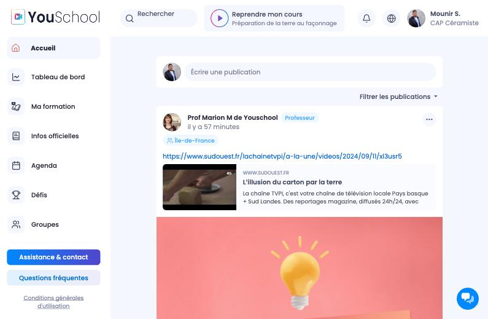

**URL :** `/cap_ceramiste`

Le fil d'actualité fonctionne comme un réseau social interne à la formation :

- **Publication** : zone de saisie "Écrire une publication" en haut pour poster un message.
- **Filtrer les publications** : bouton permettant de filtrer le contenu affiché.
- **Posts** : les publications des professeurs (badge "Professeur") et des élèves s'affichent en flux chronologique inverse. Elles peuvent contenir des liens externes avec aperçu (open graph), des images, des tags de région.
- **Interactions** : menu "..." sur chaque post pour options supplémentaires.

---

## 3. Tableau de bord


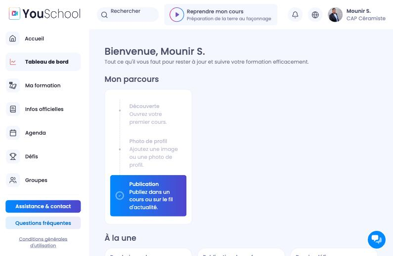

**URL :** `/cap_ceramiste/dashboard`

Le tableau de bord agrège les informations clés en un seul coup d'œil :

### Section "Mon parcours"
Stepper horizontal guidant l'élève dans sa prise en main :
1. **Découverte** – Ouvrir son premier cours
2. **Photo de profil** – Ajouter une image
3. **Publication** *(actif)* – Publier dans un cours ou sur le fil

### Section "À la une" (3 cartes)
| Carte | Contenu |
|-------|---------|
| Prochain rendez-vous | Prochain événement du calendrier avec bouton "J'y accède" |
| Publication du prof. | Dernière publication de l'enseignant avec bouton "Voir le message" |
| Dernier défi | Dernier défi actif avec son statut et bouton "Voir le défi" |

### Section "Activité" (3 indicateurs)
| Indicateur | Donnée |
|-----------|--------|
| Série de la semaine | Nombre de jours consécutifs de formation (streak) + calendrier semaine |
| Progression des cours essentiels | Pourcentage d'avancement sur les cours marqués #Essentiel |
| Nombre de publications | Compteur + bouton "Publier" |

---

## 4. Ma formation

### 4.1 Mes cours – Vue parcours

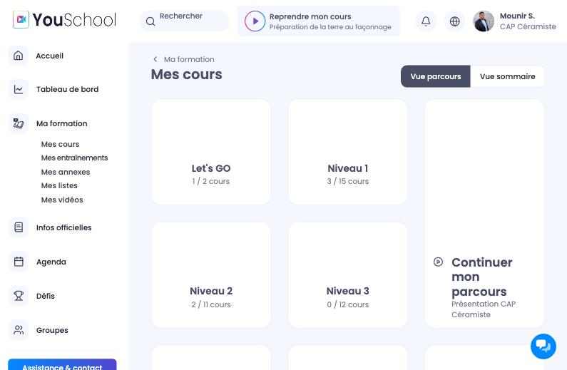

**URL :** `/cap_ceramiste/training/courses/cursus`

Grille de tuiles représentant les **blocs de formation** :
- **Let's GO** (introduction)
- **Niveau 1 à 5** (progression pédagogique)
- **Annales** (sujets d'examen)
- **Bonus** (contenu complémentaire)

Chaque tuile affiche le **ratio de cours complétés** (ex : "3 / 15 cours").
Deux vues disponibles : **Vue parcours** | **Vue sommaire**

---

### 4.2 Mes cours – Vue sommaire

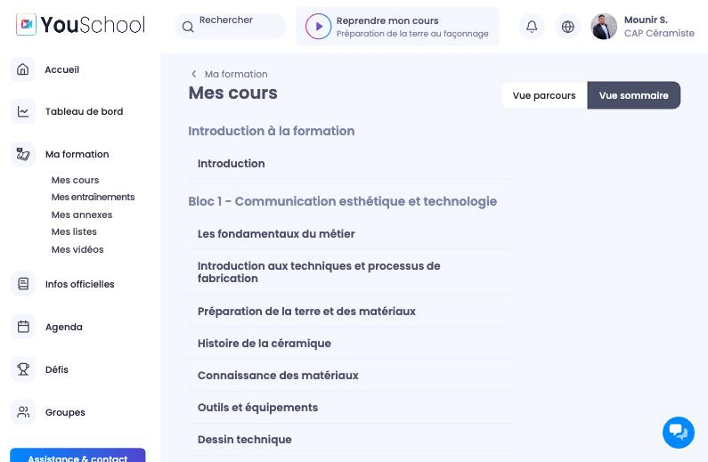

**URL :** `/cap_ceramiste/training/courses/summary`

Table des matières accordion organisée par **blocs de compétences** :
- Introduction à la formation
- Bloc 1 – Communication esthétique et technologie (Les fondamentaux du métier, Introduction aux techniques, Préparation de la terre, Histoire de la céramique, Connaissance des matériaux, Outils et équipements, Dessin technique…)

---

### 4.3 Liste des cours d'un niveau

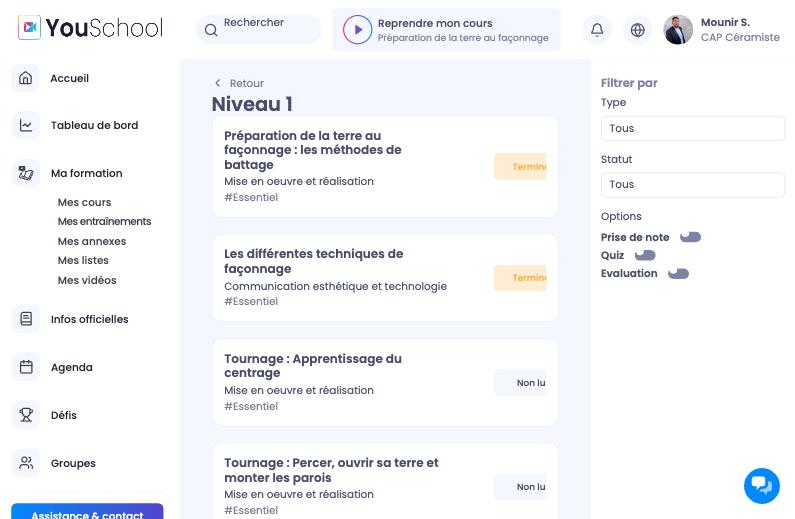

**URL :** `/cap_ceramiste/training/courses/cursus/phases/{id}`

Liste de tous les cours d'un niveau avec :
- **Titre** et **sous-titre** (matière concernée)
- **Hashtag** de type (#Essentiel, #Bonus)
- **Badge de statut** : "Terminé" (vert), "Non lu" (gris)

**Panneau droit "Filtrer par" :** Type, Statut, Options toggle (Prise de note / Quiz / Évaluation)

---

### 4.4 Page de cours (contenu + échanges)

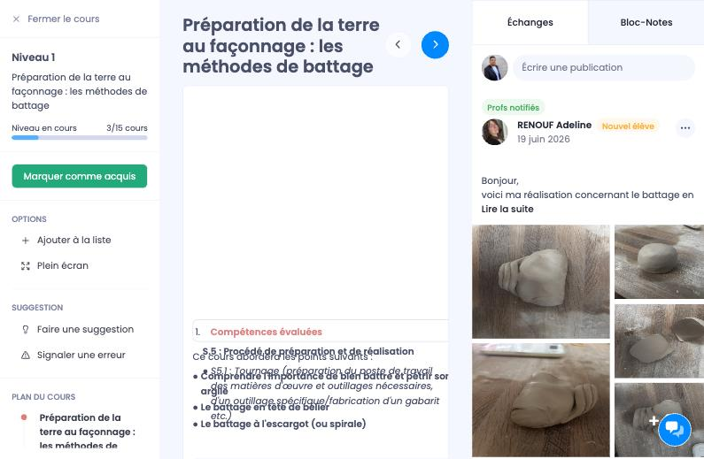

**URL :** `/cap_ceramiste/training/courses/.../publications`

Interface en trois colonnes :

**Colonne gauche :** fil d'ariane, titre du cours, barre de progression ("3/15 cours"), bouton "Marquer comme acquis", options (Ajouter à la liste, Plein écran, Faire une suggestion, Signaler une erreur), plan du cours cliquable.

**Colonne centrale :** lecteur vidéo, flèches ← → pour naviguer, section "Compétences évaluées" (accordion), contenu textuel enrichi (titres, paragraphes, images, listes).

**Colonne droite – Onglet Échanges :** zone de publication, fil de posts des élèves/professeurs liés à ce cours, photos partagées, badge "Profs notifiés".

---

### 4.5 Page de cours – Bloc-Notes

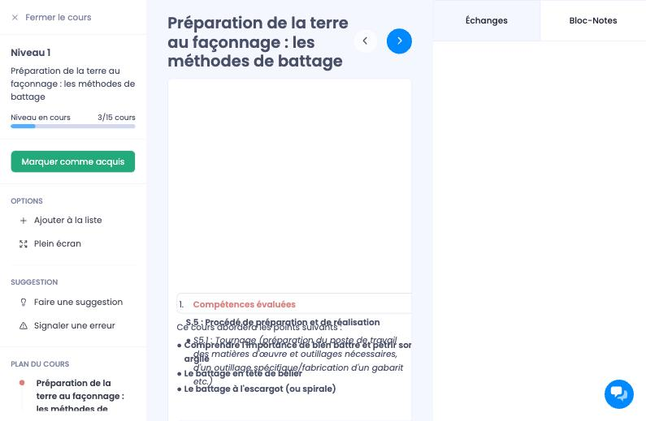

Onglet alternatif dans la colonne droite : zone de texte libre "Prenez des notes..." liée au cours consulté.

---

### 4.6 Mes entraînements (Quiz)

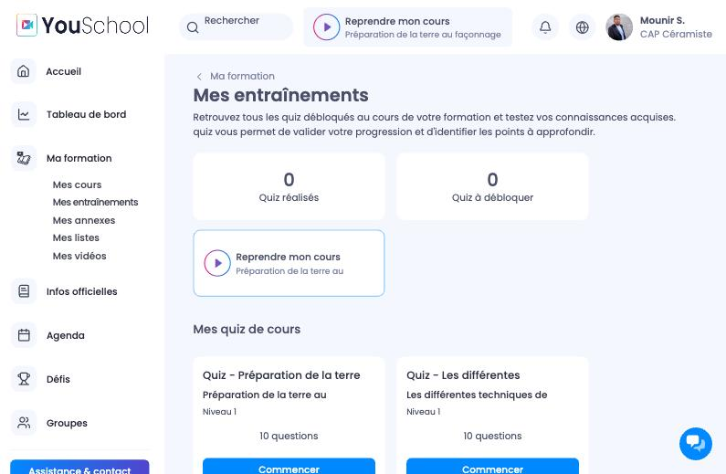

**URL :** `/cap_ceramiste/training/test-exams`

- **2 KPIs** : "Quiz réalisés" / "Quiz à débloquer"
- **Raccourci** "Reprendre mon cours"
- **Grille de quiz** : titre, cours associé, niveau, nombre de questions, bouton "Commencer"

---

### 4.7 Mes annexes

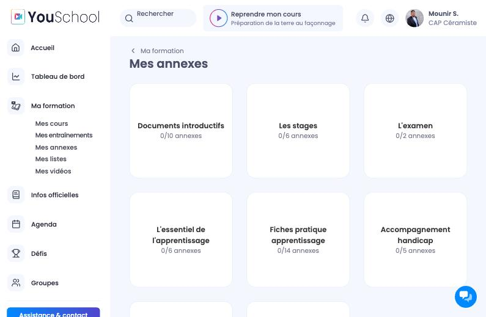

**URL :** `/cap_ceramiste/training/appendixes/folders`

Bibliothèque de documents en dossiers thématiques : Documents introductifs (0/10), Les stages (0/6), L'examen (0/2), L'essentiel de l'apprentissage (0/6), Fiches pratique apprentissage (0/14), Accompagnement handicap (0/5).

---

### 4.8 Mes listes

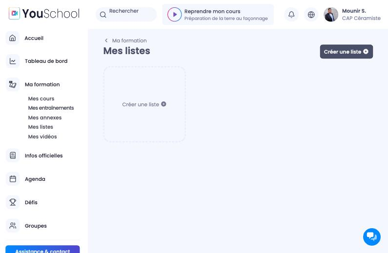

**URL :** `/cap_ceramiste/training/lesson-lists`

Outil de curation personnelle. Bouton "Créer une liste +" pour organiser des cours favoris.

---

### 4.9 Mes vidéos

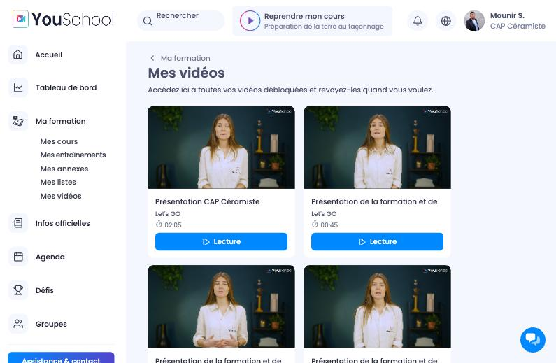

**URL :** `/cap_ceramiste/training/videos`

Galerie des vidéos débloquées : grille 2 colonnes avec miniature, titre, module, durée, bouton "Lecture".

---

## 5. Informations officielles

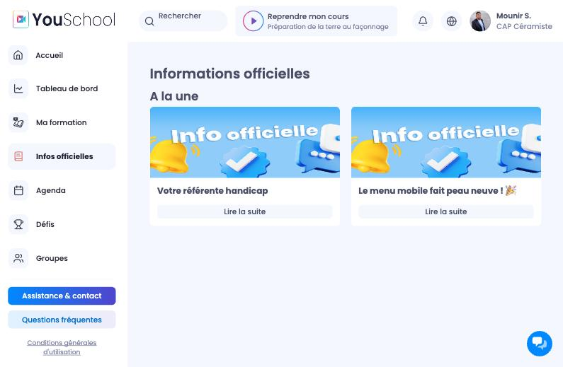

**URL :** `/cap_ceramiste/articles`

Flux d'annonces institutionnelles : cartes avec image "Info officielle", titre, bouton "Lire la suite".

---

## 6. Agenda

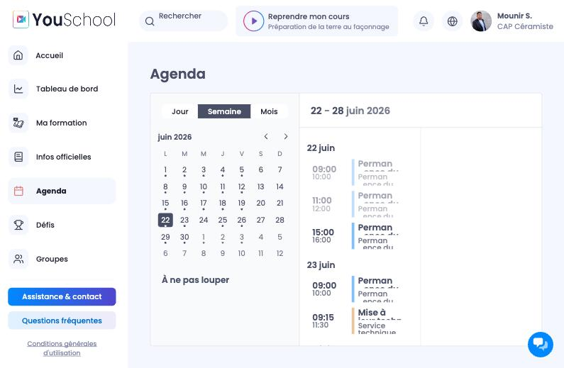

**URL :** `/cap_ceramiste/events`

Calendrier avec vues Jour / Semaine / Mois. Vue semaine : mini-calendrier + timeline avec événements colorés (Permanences prof, Mises à jour, etc.).

---

## 7. Défis

### 7.1 Liste des défis

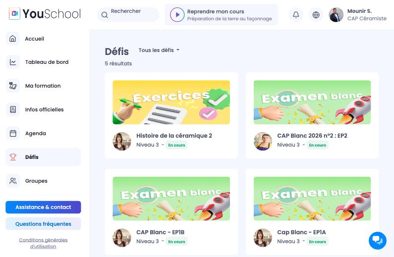

**URL :** `/cap_ceramiste/challenges`

Grille de cartes avec deux types : 🟡 **Exercices** (fond jaune) et 🟢 **Examen blanc** (fond vert). Chaque carte : image, titre, auteur, niveau, statut ("En cours").

---

### 7.2 Détail d'un défi

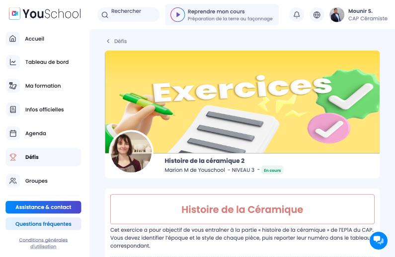

**URL :** `/cap_ceramiste/challenges/{id}`

Bannière avec image + métadonnées. Contenu : titre, description pédagogique, consignes détaillées, illustrations (images de pièces céramiques + tableau d'association).

---

## 8. Groupes

### 8.1 Liste des groupes

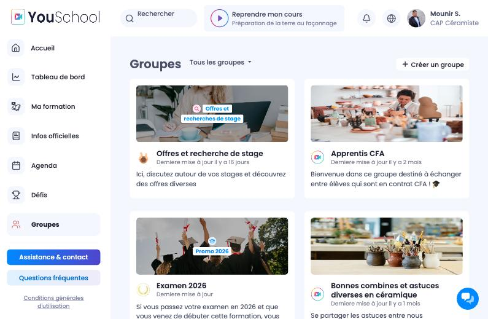

**URL :** `/cap_ceramiste/groups`

Grille de groupes thématiques avec filtre et bouton "+ Créer un groupe". Groupes : Offres et recherche de stage, Apprentis CFA, Examen 2026, Bonnes combines en céramique…

---

### 8.2 Page d'un groupe

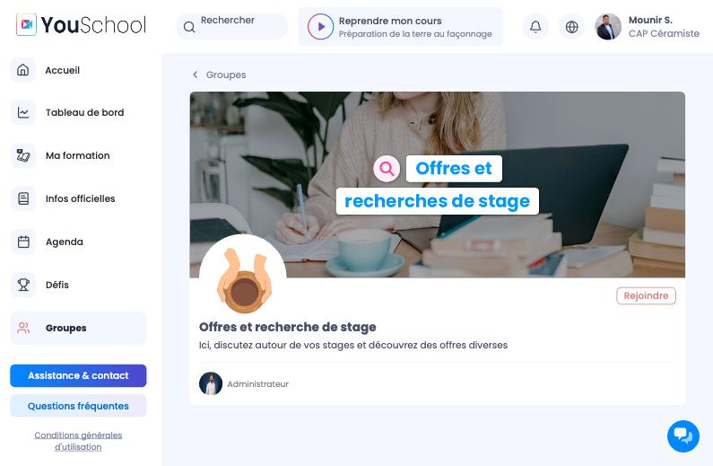

**URL :** `/cap_ceramiste/groups/{id}`

Grande bannière + description + bouton "Rejoindre" + liste des membres/admin.

---

## 9. Profil utilisateur

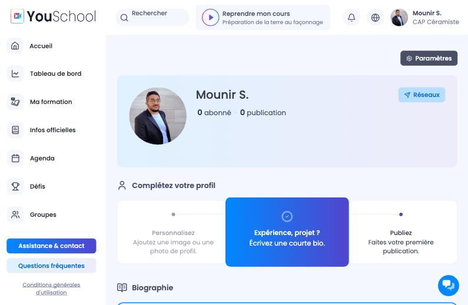

**URL :** `/cap_ceramiste/profile/{id}`

- En-tête : photo, nom, compteurs abonnés/publications, bouton "Réseaux"
- Bouton "Paramètres"
- Stepper "Complétez votre profil" (Personnalisez → Bio → Publiez)
- Section Biographie + Galerie photo

---

## 10. Éléments transversaux

### 10.1 Recherche

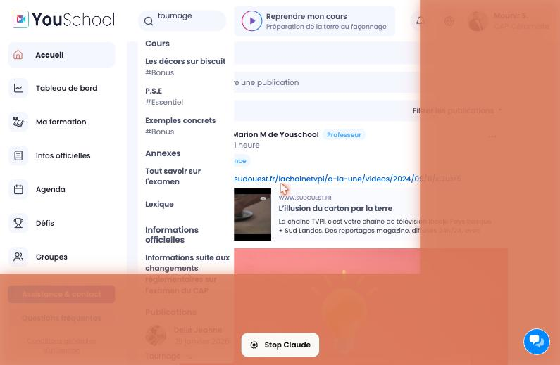

Recherche globale temps réel avec résultats catégorisés : **Cours** (avec hashtag), **Annexes**, **Informations officielles**, **Publications** (avec avatar et date).

---

### 10.2 Notifications d'école

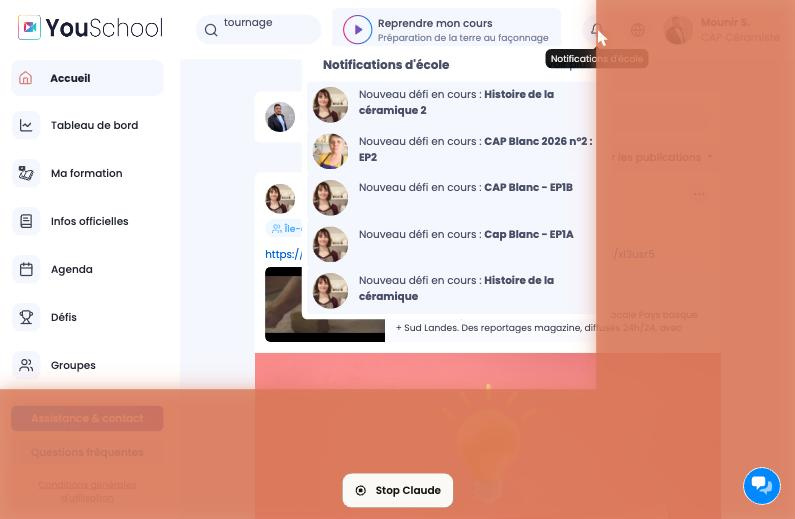

Panneau déroulant (🔔) : liste de notifications avec avatar et texte gras (ex : "Nouveau défi en cours : **Histoire de la céramique 2**").

---

### 10.3 Menu utilisateur

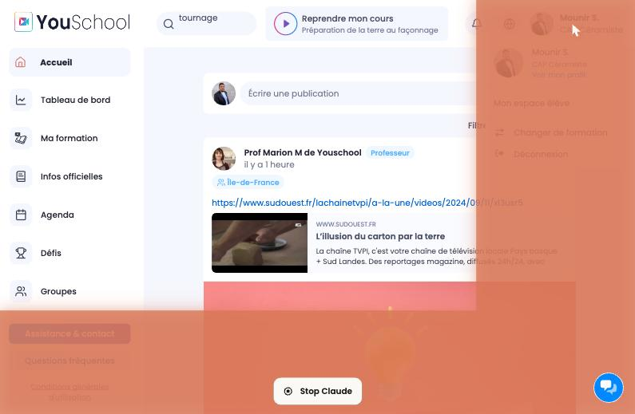

Panneau déroulant (avatar) : Voir mon profil / Mon espace élève / Changer de formation / Déconnexion.

---

## Résumé de l'architecture fonctionnelle

```
YouSchool – CAP Céramiste
├── Accueil (fil d'actualité social)
├── Tableau de bord (progression + highlights)
├── Ma formation
│   ├── Mes cours
│   │   ├── Vue parcours (tuiles par niveau)
│   │   └── Vue sommaire (table des matières)
│   │       └── [Niveau] → [Cours] → [Chapitre]
│   │           ├── Contenu (vidéo + texte)
│   │           ├── Échanges (fil de discussion)
│   │           └── Bloc-Notes (notes personnelles)
│   ├── Mes entraînements (quiz par cours)
│   ├── Mes annexes (documents par thème)
│   ├── Mes listes (curation personnelle)
│   └── Mes vidéos (galerie des vidéos débloquées)
├── Infos officielles (annonces école)
├── Agenda (calendrier des événements)
├── Défis (exercices + examens blancs)
└── Groupes (espaces de discussion thématiques)
```

---

*Document généré le 22/06/2026 – YouSchool CAP Céramiste*
